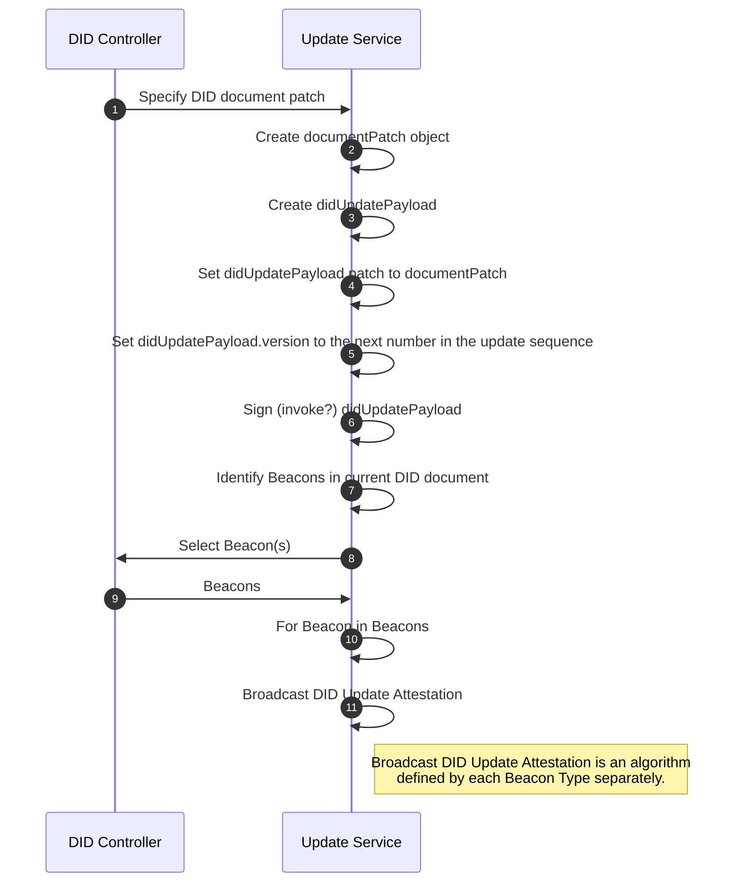

## CRUD Operations

This section defines the Create, Read, Update and Deactivate operations for the **did:btc1** method.

### Create

A **did:btc1** identifier and associated DID document can either be created
deterministically from a cryptographic seed, or it can be created from an arbitrary
genesis intermediate
DID document representation. In both cases, DID creation can be undertaken
in an offline manner, i.e., the DID controller does not need to interact with
the Bitcoin network to create their DID.

#### Deterministic Key-based Creation

For deterministic creation, the **did:btc1** identifier encodes a Secp256k1 public key.
The key is then used to deterministically generate the initial DID document.

The algorithm takes in `pubKeyBytes`, a compressed SEC encoded secp256k1
public key and optional `version` and `network` values. The algorithm returns a
**did:btc1** identifier and corresponding initial DID document.


1. Set `genesisBytes` to `pubKeyBytes`
1. Set `idType` to "key"
1. Set `did` to the result of [did:btc1 Identifier Construction](#didbtc1-identifier-construction) passing `idType` and `genesisBytes` and passing `version` and `network` if set.
1. Set `initialDocument` to the result of passing `did` into the [Read](#read) algorithm.
1. Return `did` and `initialDocument`

#### External Initial Document Creation

It is possible to create a **did:btc1** from some initiating arbitrary DID document.
This allows for more complex initial DID documents, including the ability to include
Service Endpoints and Beacons that support aggregation.

The algorithm takes in an `intermediateDocument` struct, an optional `version`
and an optional `network`. The `intermediateDocument` should be a valid DID document
accept all places where the DID document requires the use of the identifier
(e.g. the id field) should be contain the placeholder value
`did:btc1:xxxxxxxxxxxxxxxxxxxxxxxxxxxxxxxxxxxxxxxxxxxxxxxxxxxxxxxxxxxx`.
The DID document SHOULD include at least one verificationMethod and service of the type SingletonBeacon.

1. Set `idType` to "external"
1. Set `canonicalBytes` to the result of passing `intermediateDocument` into the [JSON Canonicalization](#json-canonicalization) algorithm.
1. Set `genesisBytes` to the SHA256 hash of the `canonicalBytes`.
1. Set `did` to the result of [did:btc1 Identifier Construction](#didbtc1-identifier-construction) passing `idType` and `genesisBytes` and passing `version` and `network` if set.
1. Set `initialDocument` to a copy of the `intermediateDocument`
1. Replace all `did:btc1:xxxxxxxxxxxxxxxxxxxxxxxxxxxxxxxxxxxxxxxxxxxxxxxxxxxxxxxxxxxx` values in the `initialDocument` with the `did`
1.  Optionally store `canonicalBytes` on a content addressable storage system like IPFS. If doing so, implementations MUST use CIDs generated following the IPFS v1 algorithm.
1. Return `did` and `initialDocument`.

#### did:btc1 Identifier Construction

A macro or convenience function can be used to construct **did:btc1** identifiers.
The algorithm takes two required inputs: `idType` and `genesisBytes` and
two optional inputs: `version` and `network`. If `idType` is "key", then `genesisBytes`
is a compressed SEC encoded secp256k1 public key. If `idType` is "external",
then `genesisBytes` is the byte representation of a SHA256 hash of a genesis intermediate DID document.

1. Initialize `result` to the **did:btc1** prefix string `"did:btc1:"`
2. If `version` is not null, append `version` and `":"` to `result`.
3. If `network` is not null, append `network` and `":"` to `result`.
4. If `idType` is "key", append the result of the [Bech32 encoding a secp256k1 public key]("#bech32-encoding-a-secp256k1-public-key") algorithm, passing `genesisBytes`.
5. Else if `idType` is "external",  append the result of the [Bech32 encoding a hash-value]("#bech32-encoding-a-hash-value") algorithm, passing `genesisBytes`.
6. Else, must raise "InvalidDID" exception.
7. Return `result`.


### Read

The read operation is executed by a resolver after a resolution request identifying
a specific **did:btc1** `identifier` is received from a client at Resolution Time.
The request MAY contain a `resolutionOptions` object containing additional information
to be used in resolution. The resolver then attempts to resolve the DID document
of the `identifier` at a specific Target Time. The Target Time is either provided
in `resolutionOptions` or is set to the Resolution Time of the request.

To do so it executes the following algorithm:

1. Let `identifierComponents` be the result of running the algorithm in [Parse **did:btc1** identifier](#parse-didbtc1-identifier), passing in the `identifier`.
1. Set `initialDocument` to the result of running the algorithm in [Resolve Initial Document](#resolve-initial-document) passing in the `identifier`, `identifierComponents` and `resolutionOptions`.
1. Set `targetDocument` to the result of running the algorithm in [Resolve Target Document](#resolve-target-document) passing in `initialDocument` and `resolutionOptions`.
1. Return `targetDocument`

#### Parse **did:btc1 Identifier**

The following algorithm specifies how to parse a **did:btc1** identifier according
to the syntax defined in [Syntax](#syntax). Required inputs are a DID identifier.
This algorithm returns an `identifierComponents` structure whose items are:

- network
- version
- hrp
- genesisBytes

1. Set `identifierComponents` to an empty object.
1. Using a colon (`:`) as the delimiter, split the `identifier` into an array of `components`.
1. Set `scheme` to `components[0]`
1. Set `methodId` to `components[1]`
1. If the length of `components` equals `3`, set `identifierComponents.version` to `1` and `identifierComponents.network` to `mainnet`. Set `idBech32` to `components[2]`.
1. Else if length of `components` equals `4`, check if `components[2]` can be cast to an integer. If so, set `identifierComponents.version` to `components[2]` and `identifierComponents.network` to `mainnet`. Otherwise, set `identifierComponents.network` to `components[2]` and `identifierComponents.version` to `1`. Set `idBech32` to `components[3]`.
1. Else if the length of `components` equals `5`, set `identifierComponents.version` to `components[2]`, `identifierComponents.network` to `components[3]` and `idBech32` to the `components[4]`.
1. Else MUST raise `InvalidDID` error. There are an incorrect number of components to the `identifier`.
1. Check the validity of the identifier components. The `scheme` MUST be the value `did`. The `methodId` MUST be the value `btc1`. The `identifierComponents.version` MUST be convertible to a positive integer value. The `identifierComponents.network` MUST be one of `mainnet`, ` signet`, `testnet`, or `regnet`. If any of these requirements fail then an `InvalidDID` error MUST be raised.
1. Decode `idBech32` using the Bech32 algorithm to get `decodeResult`.
1. Set `identifierComponents.hrp` to `decodeResult.hrp`.
1. Set `identifierComponents.genesisBytes` to `decodeResult.value`.
1. Return `identifierComponents`

#### Resolve Initial Document

This algorithm specifies how to resolve an initial DID document and validate
it against the `identifier` for a specific **did:btc1**. The algorithm takes as
inputs a **did:btc1** `identifier`, `identifierComponents` object and a
`resolutionsOptions` object. This algorithm returns a valid `initialDocument`
for that identifier.

1. If `identifierComponents.hrp` value is `k`, then set the `initialDocument`
   to the result of running the algorithm in [Deterministically Generate Initial DID Document](#deterministically-generate-initial-did-document)
   passing in the `identifier`, `identifierComponents` values.
1. Else If `decode_result.hrp` value is `x`, then set the `initialDocument` to
   the result of running [External Resolution](#external-resolution) passing in the `identifier`,
   `identifierComponents` and `resolutionOptions` values.
1. Else MUST raise `invalidHRPValue` error.
1. Return `initialDocument`.

##### Deterministically Generate Initial DID Document

This algorithm deterministically generates an initial DID Document from a secp256k1 public key.
It takes in a **did:btc1** `identifier` and a `identifierComponents` object and returns a `initialDocument`.

1. Set `keyBytes` to `identifierComponents.genesisBytes`.
1. Initialize a `initialDocument` variable as an empty object.
1. Set `initialDocument.id` to the `identifier`.
1. Initialize a `contextArray` to empty array:
    - Append the DID core context "https://www.w3.org/ns/did/v1"
    - Append the Data Integrity context "https://w3id.org/security/data-integrity/v2"
    - Append a **did:btc1** context
    - Set `initialDocument['@context]' to contextArray`
1. Create an initial verification method:
    - Initialize `verificationMethod` to an empty object
    - Set `verificationMethod.id` to "#initialKey"
    - Set `verificationMethod.type` to "Multikey"
    - Set `verificationMethod.controller` to `identifier`
    - Set `verificationMethod.publicKeyMultibase` to the result of the TODO: Multikey encoding algorithm passing in `keyBytes`.
1. Set `initialDocument.verificationMethod` to an array containing `verificationMethod`.
1. Initialize a `tempArray` variable to an array with the single element `verificationMethod.id`.
1. Set the `authentication`, `assertionMethod`, `capabilityInvocation`, and the
   `capabilityDelegation` properties in `initialDocument` to a copy of the `tempArray` variable.
1. Set the `initialDocument.services` property in `initialDocument` to the result
   of passing the `keyBytes` and `identifierComponents.network` to the [4.2.2.1.1 Deterministically Generate Beacon Services](#42211-deterministically-generate-beacon-services) Algorithm.
1. Return `initialDocument`.

###### Deterministically Generate Beacon Services

This algorithm deterministically generates three Beacons from the single
`keyBytes` value used to generate the deterministic **did:btc1**, one for each
of the following three Bitcoin address types for the Bitcoin `network` specified
by the DID: Pay to public key hash (p2pkh), pay to witness public key hash (p2wpkh)
and pay to taproot (p2tr). Spends from these three addresses can be produced only
through signatures from the `keyBytes`'s associated private key.
Each Beacon is of the type SingletonBeacon. The algorithm returns a `services` array.

1. Initialize a `services` variable to an empty array.
1. Set `beaconType` to `SingletonBeacon`.
1. Set `serviceId` to `#initialP2PKH`.
1. Set `beaconAddress` to the result of generating a Pay to Public Key Hash Bitcoin address from the `keyBytes` for the appropriate `network`.
1. Set `p2pkhBeacon` to the result of passing `serviceId`, `beaconType` and `beaconAddress` to [4.2.2.1.2 Create Beacon Service](#42212-create-beacon-service).
1. Push `p2pkhBeacon` to `services`.
1. Set `serviceId` to `#initialP2WPKH`.
1. Set `beaconAddress` to the result of generating a Pay to Witness Public Key Hash Bitcoin address from the `keyBytes` for the appropriate `network`.
1. Set `p2wpkhBeacon` to the result of passing `serviceId`, `beaconType` and `beaconAddress` to [4.2.2.1.2 Create Beacon Service](#42212-create-beacon-service).
1. Push `p2wpkhBeacon` to `services`.
1. Set `serviceId` to `#initialP2TR`.
1. Set `beaconAddress` to the result of generating a Pay to Taproot Bitcoin address from the `keyBytes` for the appropriate `network`.
1. Set `p2trBeacon` to the result of passing `serviceId`, `beaconType` and `beaconAddress` to [4.2.2.1.2 Create Beacon Service](#42212-create-beacon-service).
1. Push `p2trBeacon` to `services`.
1. Return the `services` array.

###### Create Beacon Service

// TODO: This is a generic algorithm. Perhaps move to appendix.

This algorithm creates a Beacon service that can be included into the services array of a DID document.
The algorithm takes in a `serviceId`, a Beacon type, `beaconType`, and a `bitcoinAddress`. It returns a `service` object.

1. Initialize a `beacon` variable to an empty object.
1. Set `beacon.id` to `serviceId`.
1. Set `beacon.type` to `beaconType`.
1. Set `beacon.serviceEndpoint` to the result of converting `bitcoinAddress` to a URI as per **[BIP21](https://github.com/bitcoin/bips/blob/master/bip-0021.mediawiki)**
1. Return `beacon`.


##### External Resolution

This algorithm externally retrieves an `intermediateDocumentRepresentation`,
either by retrieving it from content addressable storage or from the sidecar data
provided as part of the resolution request. The algorithm takes in a **did:btc1** `identifier`,
a `identifierComponents` object and a `resolutionOptions` object. It returns an
`initialDocument`, which is a conformant DID document validated against the `identifier`.

1. If `resolutionOptions.sidecarData.genesisDocument` is not null, set `initialDocument`
   to the result of passing `identifier`, `identifierComponents` and `resolutionOptions.sidecarData.initialDocument`
   into algorithm [4.2.2.2.1 Sidecar Initial Document Validation](#42221-sidecar-initial-document-validation).
1. Else set `initialDocument` to the result of passing `identifier` and `identifierComponents` to the [4.2.2.2.2 CAS Retrieval](#42222-cas-retrieval) algorithm.
1. Validate `initialDocument` is a conformant DID document according to the DID core 1.1 specification.
1. Return `initialDocument`.

###### Sidecar Initial Document Validation

This algorithm validates an `initialDocument` against its `identifier`,
by first constructing the `intermediateDocumentRepresentation` and verifying
the hash of this document matches the bytes encoded within the `identifier`.
The algorithm takes in a **did:btc1** `identifier`, `identifierComponents`
and a `initialDocument`. The algorithm returns the `initialDocument` if validated,
otherwise it throws an error.

1. Set `intermediateDocumentRepresentation` to a copy of the `initialDocument`.
1. Find and replace all values of `identifier` contained within the `intermediateDocumentRepresentation` with the string (`did:btc1:xxxxxxxxxxxxxxxxxxxxxxxxxxxxxxxxxxxxxxxxxxxxxxxxxxxxxxxxxxxx`).
1. Set `hashBytes` to the SHA256 hash of the `intermediateDocumentRepresentation`.
1. If `hashBytes` does not equal `identifierComponents.genesisBytes` MUST throw an `invalidDID` error.
1. Return `initialDocument`.

###### CAS Retrieval

This algorithm attempts to retrieve an `initialDocument` from a content
addressable storage system by converting the bytes in the `identifier`
into a content identifier (CID). The algorithm takes in an `identifier` and a
`identifierComponents` object and returns a `initialDocument`.

1. Set `hashBytes` to `identifierComponents.genesisBytes`.
1. Set `cid` to the result of converting `hashBytes` to a IPFS v1 CID.
1. Set `intermediateDocumentRepresentation` to the result of fetching the `cid` against a content addressable storage system such as IPFS.
1. Set `initialDocument` to the copy of the `intermediateDocumentRepresentation`.
1. Replace the string (`did:btc1:xxxxxxxxxxxxxxxxxxxxxxxxxxxxxxxxxxxxxxxxxxxxxxxxxxxxxxxxxxxx`) with the `identifier` throughout the `initialDocument`.
1. Return `initialDocument`.

#### Resolve Target Document

This algorithm resolves a DID document from an initial document by walking the
Bitcoin blockchain to identify Beacon Signals that announce DID Update Payloads
applicable to the **did:btc1** identifier being resolved. The algorithm takes
in an `initialDocument` and a set of `resolutionOptions`. The algorithm returns
a valid `targetDocument` or throws an error.

1. If `resolutionOptions.versionId` is not null, set `targetVersionId` to `resolutionOptions.versionId`
1. Else if `resolutionOptions.versionTime` is not null, set `targetTime` to `resolutionOptions.versionTime`
1. Set `targetBlockheight` to the result of passing `targetTime` to the algorithm [4.2.3.1 Determine Target Blockheight](#4231-determine-target-blockheight).
1. Set `sidecarData` to `resolutionOptions.sidecarData`
1. Set `currentVersionId` to 1.
1. If `currentVersionId` equals `targetVersionId` return `initialDocument`
1. Set `updateHashHistory` to an empty array.
1. Set `contemporaryBlockheight` to 0.
1. Set `contemporaryDIDDocument` to the `initialDocument`
1. Set `targetDocument` to the result of calling the [4.2.3.2 Traverse Blockchain History](#4232-traverse-blockchain-history) algorithm passing in `contemporaryDIDDocument`, `contemporaryBlockheight`, `currentVersionId`, `targetVersionId`, `targetBlockheight`, `updateHashHistory` and `sidecarData`.
1. Return `targetDocument`.

##### Determine Target Blockheight

This algorithm takes in an optional unix `targetTime` and returns a Bitcoin `blockheight`.

1. If `targetTime`, find the Bitcoin `block` with greatest `blockheight` whose `timestamp` is less than the `targetTime`.
2. Else find the Bitcoin `block` with the greatest `blockheight` that has at least X conformations. TODO: what is X. Is it variable?
3. Set `blockheight` to `block.blockheight`.
4. Return `blockheight`.

##### Traverse Blockchain History

This algorithm traverse Bitcoin blocks, starting from the block with the
`contemporaryBlockheight`, to find `beaconSignals` emitted by beacons within
the `contemporaryDIDDocument`. Each `beaconSignal` is processed to retrieve a
didUpdatePayload to the DID document. Each update is applied to the document and
duplicates are ignored. If the algorithm reaches the block with the blockheight
specified by a `targetBlockheight`, the `contemporaryDIDDocument` at that blockheight
is returned assuming a single canonical history of the DID document has been constructed up to that point.

The algorithm takes as inputs a `contemporaryDIDDocument`, a `contemporaryBlockheight`, a `currentVersionId`, a `targetVersionId`, a `targetBlockheight`, an array of `updateHashHistory`, and a set of `sidecarData`.

The algorithm returns a DID document.

1. Set `contemporaryHash` to the SHA256 hash of the `contemporaryDIDDocument`. TODO: NEED TO DEAL WITH CANONICALIZATION
1. Find all `beacons` in `contemporaryDIDDocument`: All `service` in `contemporaryDIDDocument.services` where `service.type` equals one of `SingletonBeacon`, `CIDAggregateBeacon` and `SMTAggregateBeacon` beacon.
1. For each `beacon` in `beacons` convert the `beacon.serviceEndpoint` to a Bitcoin address following **[BIP21](https://github.com/bitcoin/bips/blob/master/bip-0021.mediawiki)**. Set `beacon.address` to the Bitcoin address.
1. Set `nextSignals` to the result of calling algorithm [4.2.3.3 Find Next Signals](#4233-find-next-signals) passing in `contemporaryBlockheight` and `beacons`.
1. If `nextSignals.blockheight` is greater than `targetBlockheight` return `contemporaryDIDDocument`
1. Set `signals` to `nextSignals.signals`
1. Set `updates` to the result of calling algorithm [4.2.3.4 Process Beacon Signals](#4234-process-beacon-signals) passing in `signals` and `sidecarData`.
1. Set `orderedUpdates` to the list of `updates` ordered by the `targetVersionId` property.
1. For `update` in `orderedUpdates`:
- If `update.targetVersionId` is less than or equal to `currentVersionId`. Run Algorithm [4.2.3.5. Confirm Duplicate Update](#4233-verify-update-against-canonical-history) passing in `update`, `documentHistory` and `contemporaryHash`.
- If `update.targetVersionId` equals `currentVersionId + 1`:
    -  Check that `update.sourceHash` equals `contemporaryHash`, else MUST raise LatePublishing error.
    -  Set `contemporaryDIDDocument` to the result of calling [4.2.3.6 Apply DID Update](#4236-apply-did-update) algorithm passing in `contemporaryDIDDocument`, `update`.
    -  Increment `currentVersionId`
    -  If `currentVersionId` equals `targetVersionId` return `contemporaryDIDDocument`
    -  Set `updateHash` to the sha256 hash of the `update`
    -  Push `updateHash` onto `updateHashHistory`
    -  Set `contemporaryHash` to the SHA256 hash of the `contemporaryDIDDocument`
-  If `update.targetVersionId` is greater than `currentVersionId + 1`, MUST throw a LatePublishing error.
1. Increment `contemporaryBlockheight`
1. Set `targetDocument` to the result of calling the [4.2.3.2 Traverse Blockchain History](#4232-traverse-blockchain-history) algorithm passing in, `contemporaryDIDDocument`, `contemporaryBlockheight`, `currentVersionId`, `targetVersionId`, `targetBlockheight`, `documentHistory` and `sidecarData`
1. Return `targetDocument`


##### Find Next Signals

This algorithm takes in a `contemporaryBlockheight` and a set of `beacons` and
finds the next Bitcoin block containing Beacon Signals from one or more of the `beacons`.

This algorithm takes as inputs a Bitcoin blockheight specified by `contemporaryBlockheight` and an array of `beacons`.

This algorithm returns a `nextSignals` struct, containing a `blockheight`
the signals were found in and an array of `signals`. Each `signal` is a struct containing `beaconId`, `beaconType` and `tx` properties.


1. Get Bitcoin `block` at `contemporaryBlockheight`
2. Set `beaconSignals` to an empty array
3. For all `tx` in `block.txs`:
   check to see if any transaction inputs are spends from one of the Beacon addresses.
   If they are create a `signal` object containing the following fields and push `signal` to `beaconSignals`:
```
{
    "beaconId": `beaconService.id`,
    "beaconType": `beaconService.type`,
    "tx": `tx`
}
```
4. If no `beaconSignals`, set `nextSignals` to the result of algorithm [4.2.3.3 Find Next Signals](#4233-find-next-signals) passing in `contemporaryBlockheight + 1` and `beacons`.
5. Else initialize a `nextSignals` object to the following:
```
{
  "blockheight": `block.blockheight`,
  "signals": `beaconSignals`
}
```
6. Return `nextSignals`

##### Process Beacon Signals

This algorithm takes in an array of struct `beaconSignals` and attempts
to process these signals according the type of the Beacon they were produced by.
Each `beaconSignal` struct contains the properties `beaconId`, `beaconType` and a `tx`.
Additionally, this algorithm takes in `sidecarData` passed into the resolver
through the `resolutionOptions`. If `sidecarData` is present it is used to process the beacon signals.

1. Set `updates` to an empty array
1. For `beaconSignal` in `beaconSignals`
- Set `type` to `beaconSignal.beaconType`
- Set `signalTx` to `beaconSignal.tx`
- Set `signalId` to `signalTx.id`
- Set `signalSidecarData` to `sidecarData[signalId]` TODO: formalize structure of sidecarData
- Set `didUpdatePayload` to the result of passing `signalTx` and `signalSidecarData` to the Process Beacon Signal algorithm defined by the corresponding Beacon `type`. See [Section 5 Beacons](#5-update-beacons).
- If `didUpdatePayload` is not null, push `didUpdatePayload` to `updates`
1. Return `updates`


##### Confirm Duplicate Update

This algorithm takes in a DID update payload and verifies the update is a
duplicate against the hash history of previously applied updates.
The algorithm takes in an `update` and an array of hashes, `updateHashHistory`.
It throws an error if the `update` is not a duplicate, otherwise it returns.
TODO: does this algorithm need  `contemporaryHash` passed in?

1. Let `updateHash` equal the sha256 hash of the `update`.
1. Let `updateHashIndex` equal `update.targetVersionId - 2`
1. Let `historicalUpdateHash` equal `updateHashHistory[updateHashIndex]`
1. Assert `historicalUpdateHash` equals `updateHash`, if not MUST throw a LatePublishing error
1. Return

##### Apply DID Update

This algorithm attempts to apply a DID Update to a DID document, it first
verifies the proof on the update is a valid capabilityInvocation of the root
authority over the DID being resolved. Then it applies the JSON patch
transformation to the DID document, checks the transformed DID document
matches the targetHash specified by the update and validates it is a conformant
DID document before returning it. This algorithm takes inputs `contemporaryDIDDocument` and an `update`.

1. Instantiate a `schnorr-secp256k1-2025` `cryptosuite` instance.
1. Set `expectedProofPurpose` to `capabilityInvocation`.
1. Set `mediaType` to ???? TODO
1. Set `documentBytes` to the bytes representation of `update`.
1. Set `verificationResult` to the result of passing `mediaType`, `documentBytes`, `cryptosuite` and `expectedProofPurpose` into the [Verify Proof algorithm](https://w3c.github.io/vc-data-integrity/#verify-proof) defined in the VC Data Integrity specification.
1. TODO: HOW DO WE ENSURE THAT THE PROOF IS A VALID INVOCATION OF THE ROOT CAPABILITY derrived using algorithm [4.3.1.1 Derrive Root Capability]
1. Set `targetDIDDocument` to a copy of `contemporaryDIDDocument`
1. Use JSON Patch to apply the `update.patch` to the `targetDIDDOcument`
1. Verify that `targetDIDDocument` is conformant with the data model specified by the DID Core specification.
1. Set `targetHash` to the SHA256 hash of `targetDIDDocument`
1. Check that `targetHash` equals `update.targetHash`, else raise InvalidDIDUpdate error.
1. Return `targetDIDDocument`


### Update

An update is an invoked capability using the ZCAP-LD data format, signed by the key that has the authority to make the update as specified in previous DID document. Capability invocations for updates MUST be authorized using data integrity following the schnorr-secp256k1-2024 cryptosuite and a proofPurpose of `capabilityInvocation`.

1. Construct a `documentPatch` object containing the set of JSON Patch transformations to the DID document.
2. Initialize a `didUpdatePayload` variable to an empty object.
3. Set `didUpdatePayload.@context` to the following list `["https://w3id.org/zcap/v1", "https://w3id.org/security/data-integrity/v2", "https://w3id.org/json-ld-patch/v1"]`
4. Set `didUpdatePayload.patch` to `documentPatch`.
5. Set `didUpdatePayload.version` to the version of the update. (Previous version plus one)
6. Invoke the `didUpdatePayload` by creating a valid capability invocation `proof` attribute as defined in the ZCAP-LD specification. The proof should be created with Data Integrity using the `schnorr-secp256k1-2024` cryptosuite and a verificationMethod with the `capabilityInvocation` verificationRelationship in the current DID document.
7. Identify a Beacon(s) from the set of Beacon services in the current DID document being updated.
8. Pass the `didUpdatePayload` and `beacon` to the Broadcast DID Update Attestation algorithm defined for the type of Beacon selected. (See [Section 5. Beacons](#5-update-beacons))





#### Update Capabilities

##### Derive Root capability

Given a **did:btc1** `identifier`, generate a root capability. This root capability is defined as the capability that controls authorization to update the DID's document. The algorithm is as follows:

1. Define `rootCapability` as an empty object.
2. Set `@context` entry of `rootCapability` to 'https://w3id.org/zcap/v1'.
3. Set `encodedIdentifier` to result of calling algorithm `encodeURIComponent(identifier)`
3. Set `id` entry of `rootCapability` to `urn:zcap:root:${encodedIdentifier}`,
4. Set `controller` entry of `rootCapability` to `identifier`.
5. Set `invocationTarget` entry of `rootCapability` to `identifier`.

Below is an example root capability for updating the DID document for **did:btc1:k1q0rnnwf657vuu8trztlczvlmphjgc6q598h79cm6sp7c4fgqh0fkc0vzd9u**:

```{include="json/root-capability.json"}
```

##### An Invocation of the Root Capability to Update a DID document

An update invocation for a **did:btc1** is an invocation per the [ZCAP-LD specification](https://w3c-ccg.github.io/zcap-spec/). The invocation contains a `patch`, which is a JSON patch object following [RFC6902](https://datatracker.ietf.org/doc/html/rfc6902) defining how the DID document should be mutated.


Below is an example of a `didUpdatePayload`. An invoked ZCAP-LD capability containing a `patch` defining how the DID document for **did:btc1:k1q0rnnwf657vuu8trztlczvlmphjgc6q598h79cm6sp7c4fgqh0fkc0vzd9u** should be mutated.

```jsonld
{'@context': [
  'https://w3id.org/zcap/v1',
  'https://w3id.org/security/data-integrity/v2',
  'https://w3id.org/json-ld-patch/v1'
  ],
 'patch': [
  {'op': 'add',
   'path': '/service/4',
   'value': {
    'id': '#linked-domain',
    'type': 'LinkedDomains',
    'serviceEndpoint': 'https://contact-me.com'
    }}
  ],
 'proof': {
  'type': 'DataIntegrityProof',
  'cryptosuite': 'secp-schnorr-2024',
  'verificationMethod':'did:btc1:k1q0rnnwf657vuu8trztlczvlmphjgc6q598h79cm6sp7c4fgqh0fkc0vzd9u#initialKey',
  'invocationTarget':'did:btc1:k1q0rnnwf657vuu8trztlczvlmphjgc6q598h79cm6sp7c4fgqh0fkc0vzd9u',
  'capability': 'urn:zcap:root:did%3Abtc1%3Ak1q0rnnwf657vuu8trztlczvlmphjgc6q598h79cm6sp7c4fgqh0fkc0vzd9u',
  'capabilityAction': 'Write',
  'proofPurpose': 'assertionMethod',
  'proofValue':'z381yXYmxU8NudZ4HXY56DfMN6zfD8syvWcRXzT9xD9uYoQToo8QsXD7ahM3gXTzuay5WJbqTswt2BKaGWYn2hHhVFKJLXaDz'
  }
}
```


### Deactivate

To deactivate a **did:btc1**, the DID controller MUST add the property `deactivated` with the value `true` on the DID document. To do this, the DID controller constructs a valid DID Update payload with a JSON patch that adds this propery and announce the payload through a Beacon in their current DID document following the algorithm in [Section 4.3 Update](#43-update). Once a **did:btc1** has been deactivated this state is considered permanent and resolution MUST terminate.
